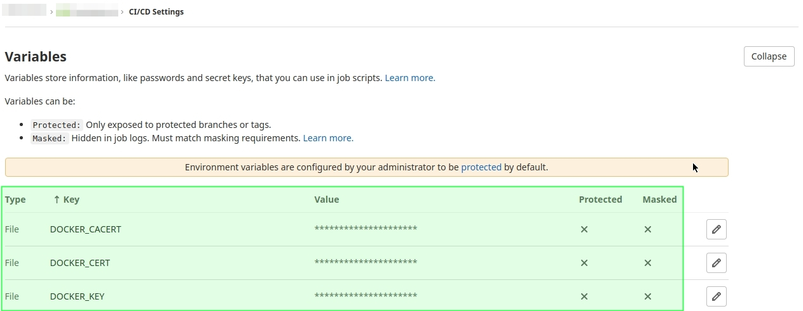

# GitLab CI (.gitlab-ci.yml) > Docker (dind) deployment > GitLab Container Registry > Docker Host API TLS

Basic `.gitlab-ci.yml` template to set up CI and Docker (Compose) application deployment to remote Docker server, using Docker API (TLS), also with integrated project's GitLab Container Registry storage ...

---

## Just read...

1. First of all, you need to install/configure Docker daemon to provide Docker API with TLS certs security. Read how to generate TLS certificates and setup Docker daemon API (see attached file `Setup-Docker-Engine-API-with-TLS.md`)
1. Then, don't forget to set TLS certificates into Group/Project CI/CD Environment variables:
   

---

## Files

### .gitlab-ci.yml

```
# Maintainer: Frantisek Preissler, pida42 <github@ntisek.cz>

# --- Default varibles for the job -------------------------------------------------------
.variables: &global_variables

  SERVER_NAME: docker1.aws.server.tld

  HOST_DEV: dev.${SERVER_NAME}
  HOST_STAGE: stage.${SERVER_NAME}
  HOST_PROD: prod.${SERVER_NAME}

  DEBUG: "true"
  DOCKER_DEBUG: "true"

  DOCKER_TLS_CERTDIR: ""

  # https://docs.docker.com/develop/develop-images/build_enhancements/#to-enable-buildkit-builds
  DOCKER_BUILDKIT: 1

  # https://docs.docker.com/compose/reference/envvars/#compose_docker_cli_build
  COMPOSE_DOCKER_CLI_BUILD: 1

# --- Runner ----------------------------------------------------------------------------
image: docker:19.03.13

services:
  - docker:19.03.13-dind

# --- Stages and their definitions ------------------------------------------------------
stages:
  - docker-build
  - docker-deploy

before_script:
  - docker login -u gitlab-ci-token -p ${CI_JOB_TOKEN} ${CI_REGISTRY}

# 1. build
.build: &build
  stage: docker-build
  script:
    - docker pull jboss/keycloak
    - docker tag jboss/keycloak:latest ${CI_REGISTRY_IMAGE}:${CI_COMMIT_SHORT_SHA}
    - docker tag ${CI_REGISTRY_IMAGE}:${CI_COMMIT_SHORT_SHA} ${CI_REGISTRY_IMAGE}:latest
    - docker push ${CI_REGISTRY_IMAGE}:${CI_COMMIT_SHORT_SHA}
    - docker push ${CI_REGISTRY_IMAGE}:latest

# 2. deploy
.deploy: &deploy
  stage: docker-deploy
  before_script:
    - apk add docker-compose
    - docker login -u gitlab-ci-token -p ${CI_JOB_TOKEN} ${CI_REGISTRY}
    - mkdir -p /root/.docker
    - cp ${DOCKER_CACERT} /root/.docker/ca.pem && cp ${DOCKER_CERT} /root/.docker/cert.pem && cp ${DOCKER_KEY} /root/.docker/key.pem && chmod 444 /root/.docker/key.pem
    - export DOCKER_HOST=tcp://${SERVER_NAME}:2376 DOCKER_TLS_VERIFY=1 DOCKER_CERT_PATH=/root/.docker
  script:
    - docker-compose -p "${CI_PROJECT_TITLE}" down --remove-orphans
    - docker system prune --all --volumes --force
    - docker-compose -p "${CI_PROJECT_TITLE}" up -d --build && docker-compose logs --tail=250

# --- Job template ------------------------------------------------------------

.job_defs: &job_template
  variables:
    <<: *global_variables

.job_config-dev:
  <<: *job_template
  only:
    - develop
  environment:
    name: Development
    url: https://${HOST_DEV}

.job_config-stage:
  <<: *job_template
  only:
    - stage
  when: manual
  environment:
    name: Staging
    url: https://${HOST_STAGE}

.job_config-prod:
  <<: *job_template
  only:
    - master
  when: manual
  environment:
    name: Production
    url: https://${HOST_PROD}

# --- Build Instance ----------------------------------------------------------

## docker1.aws.server.tld - dev
Build Docker Images:
  <<: *build
  extends: .job_config-dev

Deploy Dev:
  <<: *deploy
  extends: .job_config-dev

Deploy Stage:
  <<: *deploy
  extends: .job_config-stage

Deploy Prod:
  <<: *deploy
  extends: .job_config-prod
```

### sources_create-certs.sh 

```
#!/usr/bin/env bash

function usage {

    echo -n "
NAME
    create-certs.sh - create CA, server and client certificates

SYNOPSIS
    create-certs.sh [OPTION]...

DESCRIPTION
    Script which helps you to create CA, server and client certificates.

    Available arguments.

    --mode
        'ca' to create CA, 'server' to create server cert, 'client' to create client cert

    --hostname
        FQDN server hostname

    --host-ip
        Host IP / Client (default: none)

    --password
        Password for CA Key generation

    --target-dir
        Target directory to store result files

    --expiration-days
        Certificate expiration in day - default: 3650 days

    --ca-subject
        Subject string for CA cert (default: /C=CZ/L=Prague/O=CompanyName/CN=docker1.aws.server.tld/emailAddress=ssl@domain.tld

    --quiet
        Disable printing output messages

AUTHOR
    Frantisek Preissler, pida42 <github@ntisek.cz>
"
    exit
}

QUIET=0

EXPIRATION_DAYS=3650
CA_SUBJECT_STR="/C=CZ/L=Prague/O=CompanyName/CN=docker1.aws.server.tld/emailAddress=ssl@domain.tld"

while [[ $# -gt 1 ]]; do

    _key="$1"

    case ${_key} in
        --mode)             MODE="$2"; shift                ;;
        --hostname)         NAME="$2"; shift                ;;
        --host-ip)          HOST_IP="$2"; shift             ;;
        --password)         PASSWORD="$2"; shift            ;;
        --target-dir)       TARGET_DIR="$2"; shift          ;;
        --expiration-days)  EXPIRATION_DAYS="$2"; shift     ;;
        --ca-subject)       CA_SUBJECT_STR="$2"; shift      ;;
        --quiet)            QUIET="1"; shift                ;;
        *)                  usage                           ;;
    esac

    shift

done

function _print() {
    if [[ "${quiet}" == "1" ]]; then return;
    else echo -e "[$(date "+%Y-%m-%d %H:%M:%S")] $(printf "[%5s]" "${1}") ${_message}"; fi
}
function die () { local _message="${1} Exiting ..."; echo "$(_print ERROR)"; exit 1; }
function error () { local _message="${1}"; echo "$(_print ERROR)"; }
function info () { local _message="${1}"; echo "$(_print INFO)"; }
function debug () { local _message="${1}"; echo "$(_print DEBUG)"; }

# Usage: if is_not_empty "${FOURTYTWO}"; then ...
function is_dir() { if [[ -d "$1" ]]; then return 0; fi; return 1; }
function is_file() { if [[ -f "$1" ]]; then return 0; fi; return 1; }
function is_empty() { if [[ -z "$1" ]]; then return 0; fi; return 1; }
function is_not_empty() { if [[ -n "$1" ]]; then return 0; fi; return 1; }

# ---

info "Running script: $0 $* ..."

debug "Mode              : ${MODE}"
debug "Host/Client name  : ${NAME}"
debug "Host IP           : ${HOST_IP}"
debug "Target directory  : ${TARGET_DIR}"
debug "Expiration        : ${EXPIRATION_DAYS}"

[[ "${MODE}" == "ca" ]] && debug "CA subject string : ${CA_SUBJECT_STR}"

if is_empty "${MODE}" || [[ "${MODE}" != "ca" ]] && is_empty "${NAME}" || is_empty "${PASSWORD}" || is_empty "${TARGET_DIR}"; then
    error "Bad usage!"
    usage
fi

function createCA {
    info "Start: CA certificates ..."

    openssl genrsa \
        -aes256 \
        -passout pass:${PASSWORD} \
        -out "${TARGET_DIR}/ca-key.pem" \
        4096 && \

    openssl req \
        -passin pass:${PASSWORD} \
        -new \
        -x509 \
        -days ${EXPIRATION_DAYS} \
        -key "${TARGET_DIR}/ca-key.pem" \
        -sha256 \
        -out "${TARGET_DIR}/ca.pem" \
        -subj "${CA_SUBJECT_STR}" || exit 1

    chmod 0400 "${TARGET_DIR}/ca-key.pem"
    chmod 0444 "${TARGET_DIR}/ca.pem"

    info "Hurray! Certificates successfuly created."

    info "Result files:\n"
    info "  ${TARGET_DIR}/ca-key.pem"
    info "  ${TARGET_DIR}/ca.pem"

    info "End: CA certificates"
}

function checkCAFilesExist {
        is_file "${TARGET_DIR}/ca.pem" && is_file "${TARGET_DIR}/ca-key.pem" && return
        die "Files ${TARGET_DIR}/ca.pem and ${TARGET_DIR}/ca-key.pem doesn't exist! You need to create CA certificates first by running script first with '--mode ca' option."
}

function createServerCert {
    info "Start: Server certificates ..."

    checkCAFilesExist

    if is_empty "${HOST_IP}"; then
        IP_STRING=""
    else
        IP_STRING=",IP:${HOST_IP}"
    fi

    openssl genrsa \
        -out "${TARGET_DIR}/server-key.pem" \
        4096 && \
        openssl req \
        -subj "/CN=${NAME}" \
        -new \
        -key "${TARGET_DIR}/server-key.pem" \
        -out "${TARGET_DIR}/server.csr" && \

    echo "subjectAltName = DNS:${NAME}$IP_STRING" > "${TARGET_DIR}/extfile.cnf" && \

    openssl x509 \
        -passin pass:${PASSWORD} \
        -req \
        -days ${EXPIRATION_DAYS} \
        -in "${TARGET_DIR}/server.csr" \
        -CA "${TARGET_DIR}/ca.pem" \
        -CAkey "${TARGET_DIR}/ca-key.pem" \
        -CAcreateserial \
        -out "${TARGET_DIR}/server-cert.pem" \
        -extfile "${TARGET_DIR}/extfile.cnf" || exit 1

    rm "${TARGET_DIR}/server.csr" "${TARGET_DIR}/extfile.cnf" "${TARGET_DIR}/ca.srl"

    chmod 0400 "${TARGET_DIR}/server-key.pem"
    chmod 0444 "${TARGET_DIR}/server-cert.pem"

    info "Hurray! Certificates successfuly created."

    info "Result files:\n"
    info "  ${TARGET_DIR}/server-key.pem"
    info "  ${TARGET_DIR}/server-cert.pem"

    info "End: Server certificates"
}

function createClientCert {

    info "Start: Client certificates ..."

    checkCAFilesExist

    openssl genrsa \
        -out "${TARGET_DIR}/client-key.pem" \
        4096 && \

    openssl req \
        -subj "/CN=${NAME}" \
        -new \
        -key "${TARGET_DIR}/client-key.pem" \
        -out "${TARGET_DIR}/client.csr" && \

    echo "extendedKeyUsage = clientAuth" > "${TARGET_DIR}/extfile.cnf" && \

    openssl x509 \
        -passin pass:${PASSWORD} \
        -req \
        -days ${EXPIRATION_DAYS} \
        -in "${TARGET_DIR}/client.csr" \
        -CA "${TARGET_DIR}/ca.pem" \
        -CAkey "${TARGET_DIR}/ca-key.pem" \
        -CAcreateserial \
        -out "${TARGET_DIR}/client-cert.pem" \
        -extfile "${TARGET_DIR}/extfile.cnf" || exit 1

    rm "${TARGET_DIR}/client.csr" "${TARGET_DIR}/extfile.cnf" "${TARGET_DIR}/ca.srl"

    chmod 0400 "${TARGET_DIR}/client-key.pem"
    chmod 0444 "${TARGET_DIR}/client-cert.pem"

    mv "${TARGET_DIR}/client-key.pem" "${TARGET_DIR}/client-${NAME}-key.pem"
    mv "${TARGET_DIR}/client-cert.pem" "${TARGET_DIR}/client-${NAME}-cert.pem"

    info "Hurray! Certificates successfuly created."

    info "Result files:\n"
    info "  ${TARGET_DIR}/client-${NAME}-key.pem"
    info "  ${TARGET_DIR}/client-${NAME}-cert.pem"

    info "End: Client certificates ..."
}

[[ ! -d "${TARGET_DIR}" ]] && mkdir -p "${TARGET_DIR}"

case ${MODE} in
    ca)     createCA            ;;
    server) createServerCert    ;;
    client) createClientCert    ;;
    *)      usage               ;;
esac
```

### sources_docker-api-client-example.py

```
#!/usr/bin/env python

import requests

URL = 'https://docker1.aws.server.tld:2376/containers/json?all=1'

CA_CERT = '/home/marvin42/.docker/ca.pem'
CLIENT_CERT = '/home/marvin42/.docker/cert.pem'
CLIENT_KEY = '/home/marvin42/.docker/key.pem'


def get_container_list():
    r = requests.get(url=URL, cert=(CLIENT_CERT, CLIENT_KEY), verify=CA_CERT)
    return r.json()


def print_containers_data():
    for c in get_container_list():
        print('Container %s (%s, %s)]' % (c['Names'][0], c['Id'], c['Status']))


print_containers_data()
```
